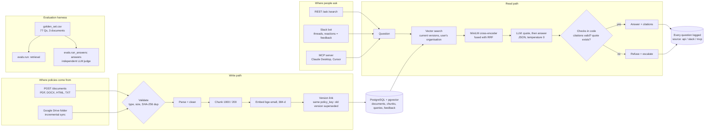

# PolicyPilot

Question answering over policy documents, with citations, an honest "I don't know", and an evaluation harness that measures every change.

> **Status:** working end to end on a laptop (Docker). Ingestion, retrieval with re-ranking, cited answers with refusal (`/ask`), policy versions, per-organisation scoping, Google sign-in, Google Drive sync, a Slack bot and an MCP server are built and tested (over 100 automated tests). Still open: the full answer-quality eval (paced by a free LLM tier), a chat web page, and deployment.

---

## Why this exists

Organisations keep their rules in long documents that almost nobody reads end to end. The same questions get asked again and again, answered inconsistently, and often answered from a version of the policy that was replaced months ago.

A general chatbot doesn't fix that. It has never seen the documents, and when it is given them it will still produce a confident answer when the documents say nothing. PolicyPilot is built around two rules:

1. Every answer must point to the passage it came from.
2. When the documents don't contain the answer, the system says so.

The third rule is about the engineering: **quality is shown with numbers, not claims.** Every retrieval change in this repo is measured against a fixed baseline before it is kept.

---

## Architecture



### Components

| Layer | What it does | Key choices |
|---|---|---|
| **Sign-in** | Google OAuth (authorization code); PolicyPilot issues its own JWT | Domain allow-list, `ADMIN_EMAILS`, account linking by email. Password login off by default; `scripts/dev_token.py` for local work |
| **Parsing** | PDF, DOCX (incl. tables), HTML, TXT; repeating footers stripped | Rejects empty/scanned files loudly; strips the byte-order mark Google Docs adds |
| **Chunking** | Recursive splitter, 1000 / 200 | Chosen by measurement: 500 split conditional rules, 1500 ranked worse |
| **Embeddings** | `BAAI/bge-small-en-v1.5`, local, 384-d | Free and unlimited, so evals can re-run constantly |
| **Storage** | PostgreSQL + pgvector (HNSW) | Records and vectors in one database, so versions and organisation are plain filters |
| **Retrieval** | Vector search, then MiniLM cross-encoder fused with the vector rank (RRF) | Hybrid keyword search is implemented but lost on this corpus, so it is off |
| **Answering** | One LLM call returns JSON: quote, answer, citations | Citations and quote are verified in code; failures become refusals with `escalate=true` |
| **Versions** | Documents sharing a `policy_key` form a chain; only the current one is searched | `GET /documents/{id}/changes` gives a sentence-level diff |
| **Organisations** | Each document and user has an organisation | A user's organisation is the default search scope, so two employers' rules don't mix |
| **Drive sync** | Read-only OAuth, encrypted refresh token, incremental by `modifiedTime` | An edited Doc becomes a new version automatically; a removed file leaves search |
| **Slack** | Socket Mode bot: threaded cited answers, tags a person on refusal | 👍/👎 reactions are stored as feedback; no public URL needed |
| **MCP** | `ask_policy`, `search_policies`, `list_policies`, `policy_changes` | Same code path and logging as `/ask` |
| **LLM access** | Any OpenAI-compatible provider (Groq, Ollama) | Throttled, failures counted and surfaced, non-retryable errors fail fast |

### Repository layout

```
app/
  api/routes/        auth (Google), documents, search, ask, drive, health
  api/services/      retrieval, reranker, answer, versioning, ingest, google_oauth, query_log, llm
  api/ingestion/     parser, cleaning, titles
  integrations/      gdrive (sync), slack_bot (logic)
  mcp_server.py      MCP server (stdio)
  core/ db/ schemas/
scripts/             migrations, rechunk, make_revision, drive_sync, slack_bot, dev_token,
                     p9_run.ps1, mcp_claude.cmd, mcp_debug.ps1
corpus/              the 3 public test documents + download script
evals/
  data/golden_set.csv    77 questions: evidence quote, slice, document, stale wording
  run.py                 retrieval eval (recall, MRR, nDCG, bootstrap CIs, per document)
  run_answers.py         answer eval (refusals, citation accuracy, LLM-judged faithfulness)
  compare.py             paired bootstrap between two runs
  check_golden.py        every evidence quote verified with the app's own parser
  results/               one JSON per run
docs/integrations.md     Google, Drive, Slack and MCP setup
tests/                   unit tests + tests against real Postgres
```

---

## Evaluation method

**Golden set:** 77 hand-written questions across three public documents in different styles: the University of Liverpool student handbook, a UK town council HR handbook (Faversham) and a Scottish council ICT acceptable-use policy (East Dunbartonshire, written for five audiences). 63 are answerable (simple, conditional, and 4 `superseded` rules whose wording changed in a revision), 14 are unanswerable. Every evidence quote is checked against the app's own parser by `evals/check_golden.py`.

**Synthetic set:** `generate.py` splits a document's extracted text into windows, asks an LLM for realistic questions with an exact evidence quote, then rejects any item whose quote doesn't appear in the source or whose wording copies it. It works on extracted text, so it works for any file format.

**Matching:** a retrieved chunk counts as a hit if it contains the evidence quote. Matching on evidence rather than chunk IDs means the same eval set stays valid when chunking changes. Two modes are reported side by side:

- **strict:** exact quote match only
- **lenient:** exact match, or at least 60% of the evidence's words present

**Retrieval metrics:** recall@1, @5, @10, MRR, nDCG@10, per slice and per document, 95% bootstrap intervals, latency. For superseded rules: is the new wording in the top 5, and did the old wording leak in.

**Answer metrics (`run_answers.py`):** unanswerable questions refused, answerable questions wrongly refused, citation accuracy (a cited passage contains the evidence), and faithfulness: a judge from a different model family (Qwen, while answers come from gpt-oss) checks every claim against the cited passages. Runs save after every question and resume, because the free LLM tier has a daily token cap.

---

## Results so far

All runs: one document (UoL handbook), 30 answerable questions, recursive chunking 1000 / 200, `bge-small-en-v1.5`, k = 10.

| Run | strict R@1 | lenient R@1 | strict R@5 | MRR | nDCG@10 | median latency |
|---|---|---|---|---|---|---|
| Vector search (baseline) | 0.60 | 0.80 | 0.967 | 0.876 | 0.871 | 20 ms |
| + bge-reranker-base (20 candidates) | 0.37 | 0.47 | 0.93 | 0.656 | 0.729 | 5,800 ms |
| + bge-reranker-base, RRF-fused with vector rank | 0.67 | 0.80 | 0.90 | 0.878 | 0.871 | 9,400 ms |
| **+ ms-marco-MiniLM-L-6-v2, RRF-fused** | **0.70** | **0.90** | 0.933 | **0.936** | **0.919** | **500 ms** |
| + LLM listwise re-rank, fused (Groq, gpt-oss-120b, 10 candidates) | 0.60 | 0.80 | 0.967 | 0.894 | 0.892 | ~20 s* |
| *Footers stripped, re-chunked (290 → 288 chunks):* | | | | | | |
| Vector search, clean chunks | 0.567 | 0.767 | 0.967 | 0.861 | 0.854 | 100 ms |
| MiniLM, RRF-fused, clean chunks | 0.60 | 0.80 | 0.967 | 0.886 | 0.892 | 500 ms |

\* LLM latency is dominated by a deliberate 20-second gap between calls to stay inside Groq's free-tier token limit. Latency is per question on a laptop CPU, and varied between identical runs (the MiniLM run measured 0.5 s median once and 1.9 s another time), so treat it as a range. The first question of each run also pays the one-off model-load cost, which is why max latency is much higher than the median.

**Current best:** a small English cross-encoder (22M parameters) fused with the vector ranking. The 120B-parameter LLM re-ranker, also fused, barely moved the numbers (MRR 0.876 to 0.894, strict R@1 unchanged) at far higher cost. It lifts MRR from 0.876 to 0.936 and lenient R@1 from 0.80 to 0.90 at about 0.5 s per query, while the larger multilingual re-ranker (278M) on its own made results worse. With 30 questions, differences of one or two questions are within noise, so these are directional results; a larger eval set is needed before treating the gains as settled.

### Phase 7 ablation (clean chunks, with 95% bootstrap intervals)

| Run | MRR (95% CI) | lenient R@1 | strict R@1 | nDCG@10 | median latency |
|---|---|---|---|---|---|
| Vector, 1000/200 chunks | 0.861 (0.77–0.95) | 0.767 | 0.567 | 0.854 | 31 ms |
| Keyword only (Postgres full-text) | 0.581 (0.43–0.74) | 0.50 | 0.333 | 0.617 | 108 ms |
| Hybrid (vector + keyword, RRF) | 0.766 (0.64–0.89) | 0.667 | 0.567 | 0.784 | 236 ms |
| Hybrid + MiniLM | 0.824 (0.71–0.92) | 0.733 | 0.60 | 0.842 | 638 ms |
| **Vector + MiniLM (chosen)** | **0.886 (0.80–0.96)** | **0.80** | **0.60** | **0.892** | 495 ms |
| Vector, 500/100 chunks | 0.776 (0.66–0.88) | 0.633 | 0.467 | 0.826 | 27 ms |
| Vector, 1500/300 chunks | 0.842 (0.72–0.95) | 0.80 | 0.533 | 0.829 | 104 ms |

**Decision:** 1000-character chunks, footers stripped, vector search, MiniLM re-ranker fused with RRF.

* **Hybrid search lost.** Keyword search alone scored 0.58: students ask in everyday words ("I was ill", "wrote our essays together", "sign up with a doctor") while the handbook uses formal terms ("extenuating circumstances", "collusion", "register with a GP"). Fusing equal-weight keyword ranks into the vector ranking pulled good results down. Hybrid stays in the code (`SEARCH_MODE=hybrid`) for corpora with codes and exact names.
* **500-character chunks split conditional rules in half** (conditional-slice MRR fell to 0.60). 1500 found the evidence as often but ranked it first less reliably.
* **The confidence intervals overlap.** With 30 questions, MiniLM's gain over plain vector search is directional, not proven. `evals/compare.py` runs a paired bootstrap on the same questions; a larger eval set is the fix.

**Reading the baseline:** retrieval nearly always finds the right passage somewhere in the top 5, but puts it first only 60% of the time under strict matching. That gap is what re-ranking was meant to close.

Answerable questions average a top similarity of 0.73 and unanswerable ones 0.66. The gap is small, so a similarity threshold alone won't be enough to decide when to say "I don't know". That feeds into the design of `/ask`.

---

## Findings and trial-and-error log

This is the part of the project I learned the most from, so it's written down in order.

### 1. The re-ranker made search worse, and it wasn't a bug

Adding `bge-reranker-base` dropped strict recall@1 from 0.60 to 0.37 and made each query about 300× slower. Before accepting that, I ruled out the obvious causes:

- **Is the model loaded correctly?** A sanity check scored an obvious match at 0.997 and an obvious non-match at 0.00004. The model works.
- **Is it a batching or padding bug?** `check_batch.py` scores the same 20 candidates all at once and one at a time. The scores were identical to four decimal places.
- **Is the metric just too strict?** `inspect_rerank.py` prints the top chunks side by side. The re-ranker's picks were genuinely wrong, not alternative correct answers.

What it actually did, for *"who do I call in an emergency on campus"*:

| Chunk | Relevant? | Re-ranker score |
|---|---|---|
| "…999 and our Campus support team (2222 from an internal telephone…" | the answer | 0.64 |
| "Serious illness affecting a close family member…" | no | 0.98 |
| "Your Academic Adviser is the first port of **call**…" | no | 0.98 |
| "…'My money? My info? I don't think so'" (fraud advice) | no | 0.98 |

The model latched onto surface cues: the word "call" in "first port of call", and urgent-sounding topics like illness, fraud and security. On long, noisy chunks from a three-column PDF, that beat the actual answer.

**Conclusion:** a re-ranker is not automatically an improvement. It has to be validated on your own corpus, with your own questions, before it goes into the pipeline. Here it would have made the product worse while looking like a best practice.

### 1b. Fusion, and a smaller model, fixed it

Two changes turned the re-ranker from harmful to useful:

- **Reciprocal Rank Fusion.** Instead of letting the re-ranker overrule search, each chunk's final position combines its vector rank and its re-ranker rank. A chunk has to do well in both to come first. With the same bge-reranker-base model, strict R@1 went from 0.37 (re-ranker alone) to 0.67 (fused), slightly above the 0.60 baseline.
- **A smaller, English, search-trained model.** `ms-marco-MiniLM-L-6-v2` is about 12× smaller than bge-reranker-base and trained on real search queries. Fused with vector rank it gave the best result so far (MRR 0.936, nDCG 0.919) at about 0.5 s per query instead of 9 s.

The lesson: bigger isn't automatically better, and a re-ranker should inform the ranking rather than replace it.

### 1c. A retired model name failed silently

The first LLM re-ranking run took about 70 seconds per question instead of 20. Every call was failing: Groq had retired `llama-3.3-70b-versatile` (404, model not found), then the replacement reasoning model (`gpt-oss-120b`) often spent its whole token budget "thinking" and returned an empty answer. Because the listwise re-ranker falls back to the original order on error, the run would have finished normally and reported vector-search results as LLM results.

Fixes: failed calls are now printed as they happen, non-retryable errors (400, 401, 403, 404) stop immediately instead of retrying for a minute, reasoning models get a larger token budget with low reasoning effort, and every run reports `LLM calls / ok / failed` with a warning above 20% failures. The final run had 37 calls, 0 failures.

**Lesson:** a fallback that keeps a pipeline running can also make a broken component look like a working one in evaluation. Failures have to be counted and surfaced, not just survived.

### 1d. The big LLM didn't beat the small cross-encoder

With the model working, the 120B LLM listwise re-ranker (fused) matched the baseline on strict R@1 (0.60) and nudged MRR from 0.876 to 0.894. The 22M MiniLM cross-encoder (fused) did better on every metric (MRR 0.936) and is far cheaper to run. Likely reasons: the LLM only saw the first 600 characters of each of 10 candidates, so answers later in a chunk were cut off, and listwise ranking by a general model is noisier than a model trained specifically for relevance. A task-specific small model beat a general large one here.

### 1e. Removing page footers made the numbers slightly worse, and that is the important result

Stripping the 41 running footers removed about 1% of the text and nothing else. Re-chunking the cleaned text produced 288 chunks instead of 290, and every chunk boundary after the first footer shifted. The scores moved down: baseline MRR 0.876 to 0.861, MiniLM-fused MRR 0.936 to 0.886.

The cleaning itself is almost certainly not harmful. What changed is where each chunk starts and ends, so some evidence sentences landed in a different chunk, next to different neighbours. That boundary shuffle alone moved MRR by 0.05, which is about the same size as the gain the best re-ranker showed.

**Lesson:** with 30 questions and one document, run-to-run differences of 0.03 to 0.05 can come from incidental chunk boundaries, not from the method being tested. The re-ranker gains are real in direction (fused MiniLM beat plain vector search on both chunkings: 0.936 vs 0.876, and 0.886 vs 0.861), but their size isn't settled. The next step is a larger eval set and confidence intervals, not more tuning.

### 2. My own scoring code had two bugs

The first baseline showed recall@1, @5 and @10 all at exactly 0.80. That is almost impossible, because some answers should land at rank 2 or 4. Checking the saved per-question ranks showed every question at rank 1 or not found, nothing in between.

- `return None` was indented inside the loop, so `first_hit_rank` gave up after checking the first result.
- The exact-match check was reversed (`chunk in evidence` instead of `evidence in chunk`), so every hit came from the looser fallback.

After fixing both, R@5 went from 0.80 to 1.00 and MRR from 0.80 to 0.876. The lesson: numbers that look too neat are a reason to check the measuring code, not a reason to celebrate.

### 3. Lenient matching flattered the results

Once both modes were reported, lenient R@1 was 0.80 and strict R@1 was 0.60. Some lenient "hits" were chunks that shared words with the answer without containing it. Some strict "misses" were other chunks that also contained the answer (the emergency number appears in more than one place). The true figure sits between the two, so both are reported and strict is treated as the headline.

### 4. Two "unanswerable" questions were answerable

While building the golden set I planned "what's the wifi password" and "what's the pass mark" as questions the handbook doesn't answer. Checking against the source showed it covers eduroam and states a 40% pass mark for levels 4 to 6. Both were relabelled. If they had stayed wrong, the system would have been penalised for answering correctly. Unanswerable labels have to be checked against the document, not assumed.

### 5. The first chunking choice mixes topics

One chunk contained the end of the Vice-Chancellor's welcome, the emergency number, fire procedures and term dates. A query quoting the emergency sentence word for word ranked that chunk third, because four topics in one chunk give a blurry vector. Character-count chunking cuts across topics. Heading-aware chunking is a planned experiment.

### 6. Synthetic questions need a human check

The generator's automatic checks catch invented quotes and copied wording. They don't catch a question that is too vague to test anything ("where can I find information about services?") or evidence that is technically real but useless (a table-of-contents line). A 10% manual spot-check is part of the process, and its acceptance rate is recorded.

### 7. Test isolation matters

Two search tests passed on an empty database and failed once the real handbook was uploaded, because real chunks outranked the test's hand-made vectors. The tests now hide existing documents inside a rolled-back transaction, so they don't depend on whatever data happens to be there.

### 8. Free LLM tiers change without warning

A provider's free model started returning "402 payment required" partway through the build. Because the LLM is configured in `.env` rather than in code, switching to Groq (or local Ollama) was a three-line change.

### 9. Phase 8: answers, and the bugs a new driver exposed

`/ask` retrieves 5 passages, numbers them, and makes one LLM call that must answer only from them and cite `[n]`. Code then drops citation numbers that don't exist, and an answer with no valid citation becomes a refusal with `escalate: true`. Every question, the chunks used, the chunks cited, the refusal reason and latency are logged for feedback.

Manual checks: a grounded answer (TV licence), an honest refusal ("company parental leave policy" was refused even though a passage about "leave" and "suspension" looked similar), and a conditional answer (illness during exams, with the 14-day rule). The pattern across them: **the model drops qualifiers** ("as it is being broadcast", "normally", "third-party evidence"), which matters for policy. Prompt v2 asks for them explicitly; `evals/run_answers.py` measures whether it works, with a judge from a different model family (Qwen) grading each claim so the answer model never grades itself.

Moving into Docker pulled in SQLAlchemy 2.1, which uses psycopg 3 by default. That exposed two hidden bugs: a missing driver, and the JWT `sub` (always a string) being compared with the integer `users.id`, which psycopg2 had silently cast. The SQLite auth tests could never catch it, so there is now a test against real Postgres. Versions are pinned in `requirements.lock`.

A test file that cleared FastAPI's dependency overrides made another file's tests run against the real database. Fixed by saving and restoring overrides per test.

### 10. Phase 9: policy versions, and a bigger eval corpus

The corpus grew to three documents in different styles: the UoL student handbook, a UK town council HR handbook (Faversham) and a Scottish council ICT acceptable-use policy (East Dunbartonshire, written for five audiences). The golden set grew from 37 to 77 questions (63 answerable, 14 unanswerable), with a `doc` column so results are reported per document. `evals/check_golden.py` verifies every evidence quote against the app's own parser. Adding the HR handbook turned one "unanswerable" question (company parental leave) into an answerable one, so it was relabelled.

Retrieval across 3 documents (vector + MiniLM): MRR 0.854 (95% CI 0.78–0.92, narrower than with 30 questions). Per document: HR 0.917, student handbook 0.881, ICT policy 0.728. The ICT policy is hardest: its formal wording ("receives a call from a member of ICT staff") doesn't match how people ask ("someone from IT phoned"), and two councils' email/internet rules compete. That conflict is why `/search` and `/ask` now take an `organisation` filter.

Versions: documents sharing a `policy_key` form a version chain. Uploading a new version marks the old one superseded; search and `/ask` only see current versions, and `GET /documents/{id}/changes` gives a sentence-level diff. `scripts/make_revision.py` creates a realistic 2025 revision of the HR handbook with four rule changes (holiday notice 4 → 2 weeks, carry-over 5 → 10 days, sick call 12 noon → 10am, paternity pay statutory → full). **Gate result: new wording in the top 5 for 4/4 questions, old wording leaked into the top 5 for 0/4.**

The answer eval found a serious generation error: asked whether a doctor's note is needed after more than a week off sick, the model said no, inverting a passage that lists three thresholds (4 days, a week, three weeks). Retrieval and the citation were correct; the model misread. The LLM judge caught it (faithfulness 0.33). Next fix to test: make the model quote the governing sentence before answering.

### 11. Integrations: what broke, and why

Two integrations broke the same way: an unpinned dependency jumped a major version inside a fresh Docker build. SQLAlchemy 2.1 switched to psycopg 3 (which then exposed a string-vs-integer user-id comparison that psycopg2 had silently cast), and `mcp` 2.x renamed `FastMCP`. Both are now pinned below the next major version, and `requirements.lock` records the tested set.

Google: plain sign-in works for any account, but Drive access (a sensitive scope) only works for accounts listed as test users while the app is unverified, and the Drive API must be enabled separately. The sync stores its last error on the connection, which made both problems obvious. Drive-edit end to end: a Google Doc changed from 25 to 28 days of leave was re-synced as version 2, and search, Slack and MCP all answered 28.

MCP on Windows: Claude Desktop from the Microsoft Store keeps its config under `%LOCALAPPDATA%\Packages\Claude_*\LocalCache\Roaming\Claude`, not `%APPDATA%\Claude`. A launcher script that logs stderr (`scripts/mcp_claude.cmd`) turned "Server disconnected" into a readable cause (the container was being rebuilt). The first question also timed out at 60 s while models loaded, so the server now loads them in the background at start-up.

### 12. Prompt v3: quote first, then answer

The answer eval caught a dangerous error: asked whether a doctor's note is needed after more than a week off sick, the model said no. It had the right passage but mixed up three thresholds (4 days, a week, three weeks). Prompt v3 makes the model copy the deciding sentence before answering, and the code refuses any answer whose quote isn't in the retrieved passages.

The first version of that check was too strict: it compared words, and the PDF text reads "selfcertification" where the model writes "self-certification", so a correct answer was refused. It now compares letters only. The lesson is the one the eval is built around: a new safety check has to be measured for wrong refusals as well as wrong answers before it ships. v3 is being measured with `run_answers --prompt v3`.

---

## Next experiments

1. **Finish the answer eval** for prompt v3 across all 77 questions and compare with v2 (paired): fewer wrong answers without more wrong refusals is the bar. That closes Phase 8.
2. **Grow the eval set:** synthetic questions per document (verified by hand), then real questions from the query log.
3. **Chat web page** with Google sign-in, so non-developers can use it.
4. **Deploy**, with the eval harness as a CI gate on every merge.
5. Retrieval follow-ups: `bge-reranker-v2-m3`; query rewriting for vocabulary gaps ("IT" vs "ICT", "phoned" vs "receives a call").

---

## Running it

Everything runs in Docker. Setup for Google, Drive, Slack and MCP: [`docs/integrations.md`](docs/integrations.md).

```powershell
copy .env.example .env                      # then fill in LLM + Google settings
docker compose up -d --build                # API on http://localhost:8000/docs
docker compose exec api python -m pytest -q
docker compose exec api python scripts/dev_token.py --email you@example.com --admin   # local token
```

Optional workers: `docker compose --profile slack --profile drive up -d`.

Evals:

```powershell
docker compose exec api python -m evals.check_golden
docker compose exec api python -m evals.run --name latest --rerank-strategy cross_fused --rerank-model cross-encoder/ms-marco-MiniLM-L-6-v2
docker compose exec api python -m evals.run_answers --name answers_v3 --prompt v3      # resumable
docker compose exec api python -m evals.compare evals/results/A.json evals/results/B.json
powershell -ExecutionPolicy Bypass -File scripts/p9_run.ps1                          # versioning gate
```

---

## Limitations

- Three documents and 77 questions: enough to see large effects and narrow the intervals, not enough to separate close configurations.
- The answer eval is paced by a free LLM tier (about 200k tokens a day), so full runs take more than one day.
- The LLM judge is itself a model; it caught real errors, but its grades are not ground truth.
- Latency is measured on a laptop CPU.
- Runs locally only; there is no chat web page yet.

---

## Stack

Python, FastAPI, SQLAlchemy, PostgreSQL + pgvector, sentence-transformers, LangChain text splitters, pypdf, python-docx, BeautifulSoup, PyJWT, google-auth, cryptography, slack_sdk, MCP Python SDK, pytest, Docker. LLMs via Groq (gpt-oss-120b answers, Qwen judge) or Ollama.
